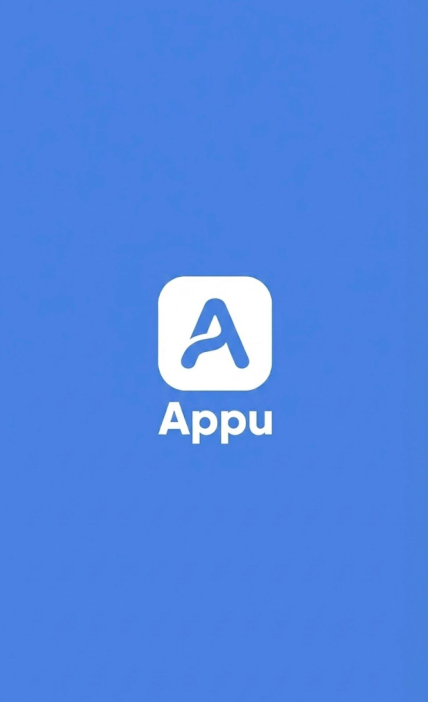

# APU

<p align="center">
  
  
  
</p>

## Nosso APP
O APU é um aplicativo de Recomendação de Celular que usa webscraping para coletar dados de sites de especificações de celular. Além disso utiliza embedding para vetorizar textos e recomendar os melhores aparelhos para o usuário.

## Começando
Crie uma pasta para o projeto e clone o repositório atual nela.

```bash
mkdir ~/APU
cd ~/APU
```

```Bash
git clone https://github.com/Colemo1208/P2---LOVELACE.git
```

## Instalando Python (Método Automático via uv)

Para não se preocupar com versões do sistema, recomendamos usar o `uv`. Ele baixa o Python 3.14 automaticamente para este projeto:

**Instale o uv:**
```bash
curl -LsSf https://astral.sh/uv/install.sh | sh
```

```bash
cd ~/APU/P2---LOVELACE
uv sync
source .venv/bin/activate
```

## Dataset 
Dentro da pasta `P2---LOVELACE` já tem um dataset de celulares `dataset_celulares_final.csv`. Porém, é possível rodar o arquivo `datasetmaker.py` e gerar um novo banco de dados maior e mais atualizado. Para isso recomenda-se criar um ambiente virtual e baixar as bibliotecas descritas em `requirements.txt`. Basta rodar essa célula no diretório do projeto:

```bash
python datasetmaker.py
```

## Main

Com o ambiente virtual configurado e as bibliotecas baixadas você deve rodar o arquivo `main.py` em um terminal separado. Abrindo o seu terminal mude para o diretório do projeto, ative o ambiente virtual e rode o `main.py`:

```bash
cd ~/APU/P2---LOVELACE
source .venv/bin/activate
python main.py
```

Para o funcionamento do Aplicativo esse terminal deve permanecer ligado. Sua máquina será o servidor que o aplicativo no celular usará para fazer a comunicação
## Inicializando Servidor

Para facilitar o download é indicado baixar o snap. Escolha o comando de acordo com seu sistema: **Ubuntu/Debian:**

```bash
sudo apt update && sudo apt install snapd
```

```bash
sudo dnf install snapd
```

É necessário criar um conta no [ngrok](https://ngrok.com/). Assim que criar, siga o passo a passo descrito na seção **Setup & Installation** ou siga as instruções abaixo:

```bash
sudo snap install ngrok
```

Poderá encontrar seu Token na seção [Authtoken](https://dashboard.ngrok.com/get-started/your-authtoken). Lembre de tirar as aspas.

```bash
ngrok config add-authtoken "SEU_TOKEN"
```

```bash
ngrok http 8000
```

Uma janela vai abrir no seu terminal.
### Iniciando o Túnel

Quando você rodar o comando `ngrok http 8000`, você verá uma saída como esta:

```console
ngrok                                                                     (Ctrl+C to quit)

Session Status                online
Account                       Seu Nome (Plan: Free)
Version                       3.3.0
Region                        South America (sa)
Latency                       45ms
Web Interface                 [http://127.0.0.1:4040](http://127.0.0.1:4040)
Forwarding                    [https://unverminous-precedentless-chelsey.ngrok-free.dev](https://unverminous-precedentless-chelsey.ngrok-free.dev) -> http://localhost:8000

Connections                   ttl     opn     rt1     rt5     p50     p90
                              0       0       0.00    0.00    0.00    0.00
```

Guarde o link da linha **Forwarding**: `https://unverminous-precedentless-chelsey.ngrok-free.dev`

Esse link é quem garante a conexão com a API.

**ATENÇÃO**: o serviço grátis do ngrok tem uma limitação: o link vai mudar caso reinicie esse terminal. Esse link será colado no código fonte do aplicativo. Assim que o código for compilado, o aplicativo funcionará se e apenas se esse terminal estiver aberto. Caso reinicie o terminal, será necessário mudar novamente o link no código fonte e recompilar novamente o código para gerar um novo APK.

## Mudando link da API

Com o link na área de transferência deve-se acessar com o editor de texto o arquivo `api_calls.dart`

```bash
nano ~/APU/P2---LOVELACE/projetos2engcommplovelace-9jh94s/lib/backend/api_requests/api_calls.dart
```

```dart
class BuscarcelularesCall {
  static Future<ApiCallResponse> call({
    String? varQuery = 'Celular bom e barato.',
    double? varPreco = 6000,
    List<String>? varMarcasList,
  }) async {
    final varMarcas = _serializeList(varMarcasList);

    final ffApiRequestBody = '''
{
  "query_montada": "${escapeStringForJson(varQuery)}",
  "filtros": {
    "orcamento_max": ${varPreco},
    "marcas_preferidas": ${varMarcas},
    "target_ram": 0
  }
}''';
    return ApiManager.instance.makeApiCall(
      callName: 'Buscarcelulares',
      apiUrl: 'SEU_LINK',
      callType: ApiCallType.POST,
      headers: {},
      params: {},
      body: ffApiRequestBody,
      bodyType: BodyType.JSON,
      returnBody: true,
      encodeBodyUtf8: false,
      decodeUtf8: false,
      cache: false,
      isStreamingApi: false,
      alwaysAllowBody: false,
    );
  }

```


Navegue pelo nano usando as setas, porerá colar o link utilizando `Ctrl + Shift + C`
Ao finalizar use 
- **`Ctrl` + `O`** 
- **`Enter`**
- **`Ctrl` + `X`**

Assim o arquivo será salvo e o aplicativo estará pronto para ser compilado

## Configurando Flutter

Para rodar o projeto será necessário baixar algumas dependências. Escolha seu sistema operacional: **Ubuntu/Debian:**

Bash

```
sudo apt update
sudo apt install -y git wget curl unzip bash-completion build-essential openjdk-17-jdk
```

**Fedora:**

Bash

```
sudo dnf install -y git wget curl unzip bash-completion java-17-openjdk-devel
sudo dnf groupinstall -y "Development Tools"
```

Com as ferramentas baixadas e o diretório definido é necessário baixar o Flutter. Vamos baixar dentro da pasta `~/APU`: 

```bash 
cd ~/APU 
git clone [https://github.com/flutter/flutter.git (https://github.com/flutter/flutter.git) -b stable
````

No Bash (ou `.bashrc`), rode o seguinte comando para adicionar ao PATH:
```bash
echo 'export PATH="$HOME/APU/flutter/bin:$PATH"' >> ~/.bashrc
source ~/.bashrc
````

Com esses passos o Flutter já está baixado no seu PC. Para compilar será necessário baixar o Android Studio.


```bash
cd ~/Downloads
wget [https://redirector.gvt1.com/edgedl/android/studio/ide-zips/2023.1.1.28/android-studio-2023.1.1.28-linux.tar.gz](https://redirector.gvt1.com/edgedl/android/studio/ide-zips/2023.1.1.28/android-studio-2023.1.1.28-linux.tar.gz)
```


```bash
tar -xvf android-studio-*-linux.tar.gz
mv android-studio ~/APU/
```

Agora será necessário rodar o Android Studio . O objetivo é baixar por ele as ferramentas de compilação . Rode a seguinte célula e avance na tela que abrir: **Next** > **Standard** > **Next** > **Finish**.


```bash
~/APU/android-studio/bin/studio.sh
```

Configure o diretório do Android:

```bash
flutter config --android-sdk ~/Android/Sdk
```

Por fim aceite as licenças :

```bash
flutter doctor --android-licenses
```

## Compilando o Código

```bash
cd ~/APU/P2---LOVELACE/projetos2engcommplovelace-9jh94s
flutter pub get && flutter build apk --release
```

O arquivo `.apk` que será compilado ficará em `build/app/outputs/flutter-apk/app-release.apk`. Basta rodar:

```bash
cd ~/APU/P2---LOVELACE/projetos2engcommplovelace-9jh94sbuild/app/outputs/flutter-apk/
```

Com isso em mãos basta baixar o APK no seu celular e rodar. Lembre que caso o terminal do ngrok seja fechado será necessário mudar novamente o link da API e recompilar um novo APK.